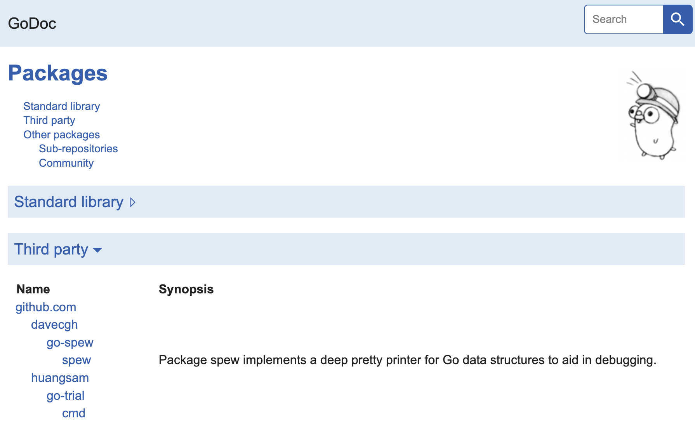

# Go Trial

[](https://github.com/huangsam/go-trial/actions)

Curated learning designed for Software Engineers proficient in [Python] / [Java] / [C++]
and need to quickly ramp up their Go skills for work.

> The best time to start was yesterday. The second best time is now.

There's no better time to master Golang than now! 🔥


## Getting started

Here are the commands you need to know:

```shell
# Setup tools
./setup.sh

# Run build
./build.sh

# Run tests
./test.sh
```

### Documentation

To see the documentation via CLI:

```shell
# Show docs for package
go doc github.com/huangsam/go-trial/pkg/basicintro

# Show docs for package entity
go doc github.com/huangsam/go-trial/pkg/basicintro.Person
```

To see the documentation via web server:

```shell
# Run godoc server
godoc -http :8080
```

Then open up a browser on <http://localhost:8080>.



### Generate mocks

To generate mocks for testing, add interfaces to `.mockery.yaml`.

Then run the following commands:

```shell
# Run mockery to generate mocks
mockery
```

## Goals

Here is a checklist of things I want to cover:

- [x] [Intro to functions, structs](pkg/basicintro/)
- [x] [Data structures](pkg/datastructure/)
- [x] [Goroutines, channels, sync primitives](pkg/concurrency/)
- [x] [Interfaces, generics, mocking](pkg/abstraction/)
- [x] [Real world integrations](pkg/realworld/)

## Useful resources

### GitHub projects

#### Content

- [avelino/awesome-go](https://github.com/avelino/awesome-go): A curated list of awesome Go frameworks, libraries, and software.
- [golang-standards/project-layout](https://github.com/golang-standards/project-layout): Standard Go project layout.

#### Tools

- [golangci/golangci-lint](https://github.com/golangci/golangci-lint): Fast linters runner for Go.
- [knadh/koanf](https://github.com/knadh/koanf): Simple configuration management for Go.
- [urfave/cli](https://github.com/urfave/cli): Simple, fast, fun CLIs for Go.
- [vektra/mockery](https://github.com/vektra/mockery): Mock code autogenerator for Go.

### Online tutorials

- [A Tour of Go](https://go.dev/tour/list): An interactive tour of Go.
- [Go by Example](https://gobyexample.com): Annotated programs in Go.

### Blog posts

- [Organizing Go code](https://go.dev/blog/organizing-go-code): A blog post on how to organize Go code.
- [Package names](https://go.dev/blog/package-names): A blog post on how to name Go packages effectively.
- [Go Concurrency Patterns: Pipelines and cancellation](https://go.dev/blog/pipelines): A blog post on how to use pipelines in Go.
- [Go Concurrency Patterns: Context](https://go.dev/blog/context): A blog post on using context in Go.
- [Structured Logging with slog](https://go.dev/blog/slog): A blog post on structured logging in Go using the slog package.
- [4 Mocking Approaches for Go](https://www.twilio.com/en-us/blog/4-mocking-approaches-go): A blog post on mocking techniques in Go.

[Python]: https://github.com/huangsam/ultimate-python
[Java]: https://github.com/huangsam/java-trial
[C++]: https://github.com/huangsam/cpp-trial
