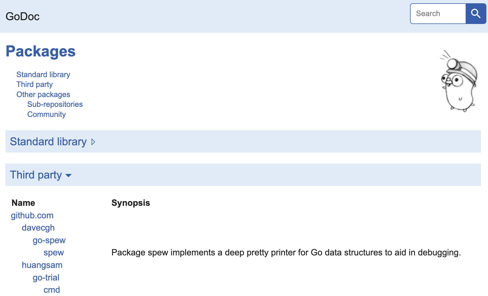

# Developer User Guide

This content is for developers who are want to experiment with the repository at
a deeper level.

## Run the binary

After the build runs successfully, the `gotrial` binary should exist at the
`bin` directory of this repo. Here are some commands to start with:

```shell
# Get help for global command
./bin/gotrial help

# Get help for subcommand
./bin/gotrial help demo

# Run a command
./bin/gotrial demo
```

## See the docs

To see the codebase docs via CLI:

```shell
# Show docs for package
go doc github.com/huangsam/go-trial/pkg/basicintro

# Show docs for package entity
go doc github.com/huangsam/go-trial/pkg/basicintro.Person
```

To see the codebase docs via web server:

```shell
# Run godoc server
godoc -http :8080
```

Then open up a browser on <http://localhost:8080>.



## Generate mocks

To generate mocks for testing, add interfaces to `.mockery.yaml`.

Then run the following command:

```shell
# Run mockery to generate mocks
mockery
```

## Run with Docker

Here are the steps to run the `gotrial` CLI as a container:

```shell
# Run Docker build
bash scripts/docker.sh

# Run Docker container
docker run --rm -it huangsam/gotrial:latest
```
